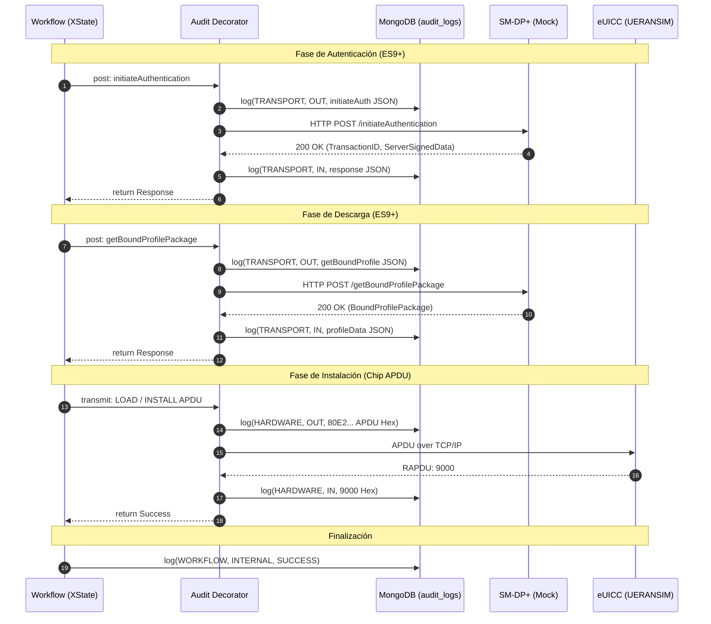

```mermaid
sequenceDiagram
    autonumber
    participant W as Workflow (XState)
    participant DA as Audit Decorator
    participant M as MongoDB (audit_logs)
    participant SM as SM-DP+ (Mock)
    participant EU as eUICC (UERANSIM)

    Note over W, EU: Fase de Autenticación (ES9+)

    W->>DA: post: initiateAuthentication
    DA->>M: log(TRANSPORT, OUT, initiateAuth JSON)
    DA->>SM: HTTP POST /initiateAuthentication
    SM-->>DA: 200 OK (TransactionID, ServerSignedData)
    DA->>M: log(TRANSPORT, IN, response JSON)
    DA-->>W: return Response

    Note over W, EU: Fase de Descarga (ES9+)

    W->>DA: post: getBoundProfilePackage
    DA->>M: log(TRANSPORT, OUT, getBoundProfile JSON)
    DA->>SM: HTTP POST /getBoundProfilePackage
    SM-->>DA: 200 OK (BoundProfilePackage)
    DA->>M: log(TRANSPORT, IN, profileData JSON)
    DA-->>W: return Response

    Note over W, EU: Fase de Instalación (Chip APDU)

    W->>DA: transmit: LOAD / INSTALL APDU
    DA->>M: log(HARDWARE, OUT, 80E2... APDU Hex)
    DA->>EU: APDU over TCP/IP
    EU-->>DA: RAPDU: 9000
    DA->>M: log(HARDWARE, IN, 9000 Hex)
    DA-->>W: return Success

    Note over W, EU: Finalización

    W->>M: log(WORKFLOW, INTERNAL, SUCCESS)
```

fff

```mermaid
sequenceDiagram
    autonumber
    participant W as Workflow (XState)
    participant DA as Audit Decorator
    participant M as MongoDB (audit_logs)
    participant SM as SM-DP+ (Mock)
    participant EU as eUICC (UERANSIM)

    Note over W, EU: Fase de Autenticación (ES9+)

    W->>DA: post: initiateAuthentication
    DA->>M: log(TRANSPORT, OUT, initiateAuth JSON)
    DA->>SM: HTTP POST /initiateAuthentication
    SM-->>DA: 200 OK (TransactionID, ServerSignedData)
    DA->>M: log(TRANSPORT, IN, response JSON)
    DA-->>W: return Response

    Note over W, EU: Fase de Descarga (ES9+)

    W->>DA: post: getBoundProfilePackage
    DA->>M: log(TRANSPORT, OUT, getBoundProfile JSON)
    DA->>SM: HTTP POST /getBoundProfilePackage
    SM-->>DA: 200 OK (BoundProfilePackage)
    DA->>M: log(TRANSPORT, IN, profileData JSON)
    DA-->>W: return Response

    Note over W, EU: Fase de Instalación (Chip APDU)

    W->>DA: transmit: LOAD / INSTALL APDU
    DA->>M: log(HARDWARE, OUT, 80E2... APDU Hex)
    DA->>EU: APDU over TCP/IP
    EU-->>DA: RAPDU: 9000
    DA->>M: log(HARDWARE, IN, 9000 Hex)
    DA-->>W: return Success

    Note over W, EU: Finalización

    W->>M: log(WORKFLOW, INTERNAL, SUCCESS)
```