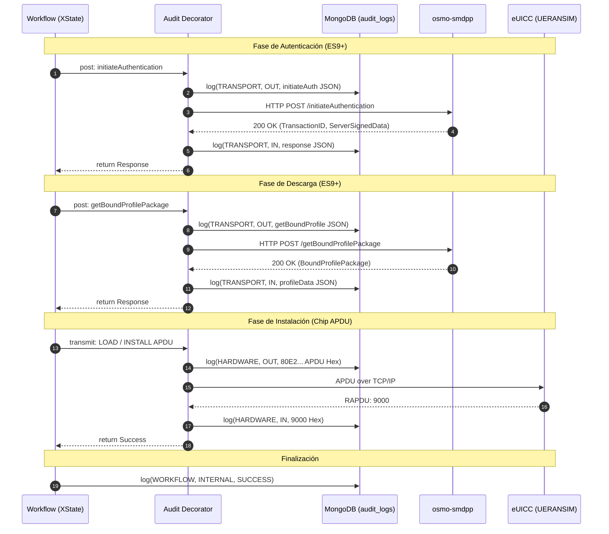

# Flujo de Aprovisionamiento RSP

El ciclo de descarga e instalación de un perfil eSIM en la SIM Virtual (eUICC) consta de 3 fases principales de comunicación. 

A continuación se detalla la secuencia de operaciones coordinadas por el motor de máquinas de estado de Unuko ToolKit, interactuando con el servidor **osmo-smdpp** de Osmocom:

---

## Diagrama de Secuencia General

---

## Detalle de Fases

### 1. Fase de Autenticación (ES9+ / ESips)
*   **initiateAuthentication**: El cliente solicita abrir una sesión. El servidor **osmo-smdpp** responde con un identificador de transacción y datos firmados digitalmente.
*   **authenticateClient**: El cliente envía estos datos al eUICC, que a su vez genera sus firmas y valida la identidad del servidor.

### 2. Fase de Descarga (ES9+ / ESips)
*   **getBoundProfilePackage**: El cliente solicita el paquete de perfil final. El servidor **osmo-smdpp** encripta la eSIM en un bloque binario seguro (`BoundProfilePackage`) usando claves generadas en el paso anterior y lo entrega.

### 3. Fase de Instalación (APDU Hex)
*   El motor de orquestación de Unuko toma el paquete encriptado y lo desglosa en bloques binarios compatibles con comandos APDU de tarjeta inteligente (`80E2...`).
*   Los comandos se transmiten al socket del eUICC simulado en UERANSIM. Cada comando es procesado por el procesador del chip virtual, que retorna el código de respuesta estándar `9000` (Success).
